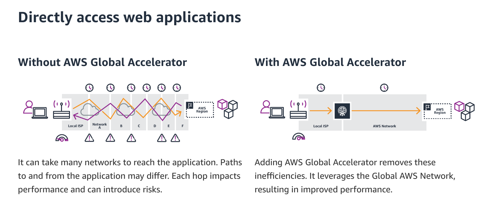

# What is Global Accelerator?

Global accelerator is an AWS service which allows developers to route
application traffic to various points of presence around the world.
It has a distinct advantage over regular load-balancing / latency-based or geolocation Route 53 routing policies in that traffic destined for an application is
routed through AWS's private global network, instead of over the internet.

The service works by providing you with a static IP address which serves as
the user-facing endpoint for all application traffic. This IP address is
announced from multiple AWS BGP endpoints with the aim of ensuring that
ISPs route traffic to the IP address via the shortest possible path.

Once the traffic reaches an AWS endpoint, the traffic is then routed through AWS's private network.