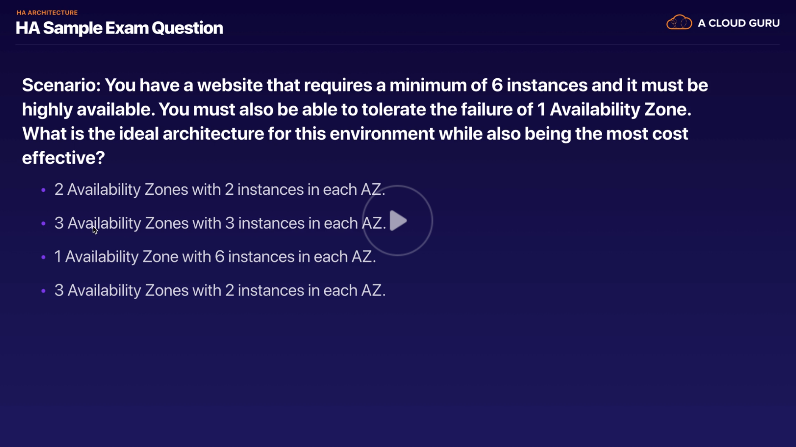

# High Availability Architecture Theory

## Overview

The cardinal rule is to always plan for failure. Of course, you must set a desired failure tolerance capability for your software. For example,
do you want your software to be able to survive the failure of one availability zone? One region? One instance?

No matter what, one of the main reasons we build and deploy applications on the cloud is because of its capability to help our applications
**resist failure** of one or more parts.

## Sample Exam Question

In this case, we are trying to build our applications to survive the failure of one availability zone. We need a minimum of 6 instances to successfully run the application.

The only valid answer in this case is 3 availability zones with 3 instances in each AZ. This is because, in the event of a loss of an availability zones, the normal number of instances (9), would become 6 instances, which satisfies the minimum number of instances required to run the application.

The final answer (3 AZs with 2 instances in each AZ) does not satisfy the availability requirements. Under normal operation, the 6 instances it provides are sufficient to run the application. However, in the event of an availability zone failure we are left with only 4 instances (2 availability zones with 2 instances in each.) This would not satisfy the requirements needed to run the application.

# Exam Tips

* Know about various HA redundancy features such as Multi-AZ deployment for RDS (and the difference between it and the performance-oriented feature Read Replicas).
* Know the difference between **"scaling up"** and **"scaling out"**.
    * **Scaling up** - Increase resources inside of the EC2 instances (change from a `t2.micro` to a `g3.4xlarge`)
    * **Scaling out** - Use autoscaling groups to add additional instances of the same type to 
* Know to use multiple AZs and multiple regions wherever feasible.
  * Would be good to know about any cost-related caveats here though.
* Know the different S3 storage classes and how they apply to high-availability design.
  * Retrieval times, multi-AZ storage etc.
  * Regular S3 and S3-IA are highly available.
  * S3 reduced redundancy and S3 single-AZ are not considered highly available.
* Read questions carefully and always consider the cost element. Make sure you satisfy the minimum requirements of the application under failure conditions but watch out for extreme overkill answers where simpler, more cost-effective answers exist.