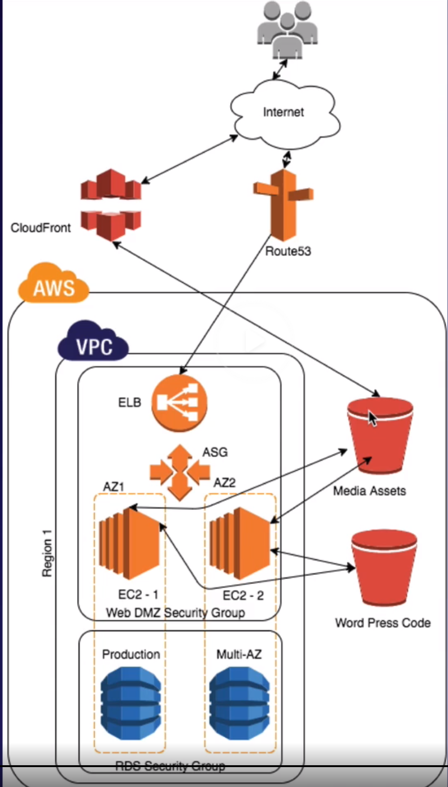

# Overview

In this lab we will deploy a WordPress site using many of the AWS services we have learned about so far throughout the course.

## Blueprint

## S3 Buckets

* Bucket containing code: `acloudguru-wordpress-code-ajn-2020`
* Bucket containing media assets: `acloudguru-wordpress-media-ajn-2020`

# Problem

Looks like the CloudFront distribution is redirecting us to S3. Is this normal or is this the result of some yet-to-happen propagation? Figure out after lunch.
Yep, it was just a matter of waiting for the change to propagate. We want to look more into this to figure out why it initially redirected to s3 instead of loading from CloudFront directly.

# Exam Tips

* Rebooting your RDS instance with failover is a way of simulating an AZ loss in the case of multi-AZ RDS instances as it will fail the instance over to the standby instance in the other availability zone.