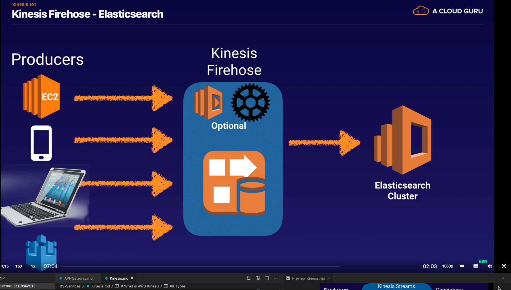

# Background

**Streaming Data** - continuously generated data which comes in quickly in small chunks, sometimes from many sources.
    * Purchases from online stores (I think this is a bad example but it's in the acloud.guru session)
    * Stock prices
    * Multiplayer game data
    * Social network data (again probably not the best example IMO)
    * Geospatial data (think your Uber map)
    * IoT sensor data

# What is AWS Kinesis

AWS Kinesis is a place to send your streaming data to! It makes it easy to load and analyze streaming data, and also provides the ability for you to build your own custom applications with this data.

## Types

* Kinesis Streams - 24h - 7d retention time
  * Each stream is contained in a "shards" (5 transactions per second for reads, up to a maximum total data read rate of 2 MB per second and 1000 records per second for writes up to a maximum total data write rate of 1 MB per second, including partition keys)

* Kinesis Firehose - data must be processed as it comes in - NO RETENTION unless using lambda functions are assigned to store them somewhere safe like S3.

* Kinesis Analytics - works with Streams and Firehose to analyze data coming in, and stores the results in various perisstant storage services such as S3, Redshift or Elasticsearch Cluster.

# Exam Tips

* Kinesis Streams is the only type of Kinesis which uses **shards**. If you see **shards** come up, think **Kinesis Streams**.