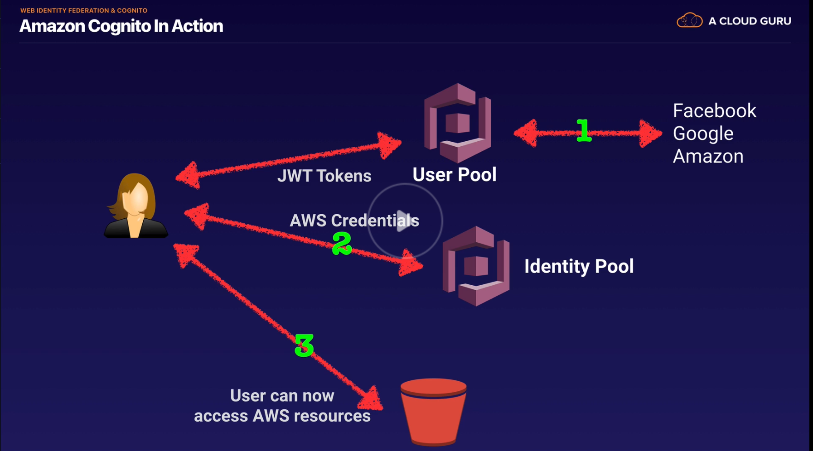

# Background

Web Identity Federation lets you give your users access to AWS resources after they have successfully authenticated with a web-based identity provider like Amazon, Facebook or Google. Following successful authentication, the user receives an authentication code from the Web ID provider which they can trade for temporary AWS security credentials.

From the [AWS Website](https://aws.amazon.com/cognito/):

> Amazon Cognito lets you add user sign-up, sign-in, and access control to your web and mobile apps quickly and easily. Amazon Cognito scales to millions of users and supports sign-in with social identity providers, such as Facebook, Google, and Amazon, and enterprise identity providers via SAML 2.0. 

# What is AWS Cognito

AWS Cognito is a web identity federation service with the following features:

* Sign-up and sign-in to your apps
* Access for guest users
* Acts as an "Identity Broker" between your application and WebID providers so you don't need to write any additional code.
  * For example, abstracts away Sign in with Facebook and Sign in with Google.
* Synchronizes user data for multiple devices

## How does it work?

* Cognito brokers between the application and an identity provider such as Google or Facebook
* Credentials map to an IAM role which grants access to designated resources.
* No need for an application to store AWS credentials on a device.
* Gives users a very simple user experience

## User Pools vs Identity Pools

* **User Pools** - user directories used to manage sign-up and sign-in functionality. Users can sign-in directly (username + password specific to the service) or using Facebook, Amazon or Google. Cognito acts as an identity broker between the identity provider and AWS. Successful authentication generates a JSON Web Token.
* **Identity Pools** - provide AWS credentials to access AWS services like S3 or DynamoDB.

## Cognito Synchronization

Cognito tracks the association between user's devices and the accounts they're logged in on. Cognito uses Push Synchronization to push updates and synchronize user data across multiple devices. Uses SNS to send a notification to all devices associated with a user identity when data stored in the cloud changes

//TODO find out where this is used in practice, see Trello.

# Exam Tips

* Identity Federation allows users to authenticate with third party services (identity providers) such as Google or Facebook.
* The user authenticates first with the ID provider, then receives an authentication token which is exchanged for temporary AWS credentials allowing them to assume an IAM role.
* Cognito is an "identity broker" which handles interaction between your applications and the Web ID provider (which is super valuable because it means WE don't have to write the code to do that.)
* User pools are user-centric, handling user registration, authentication and account recovery.
* Identity pools authorize access to AWS resources.